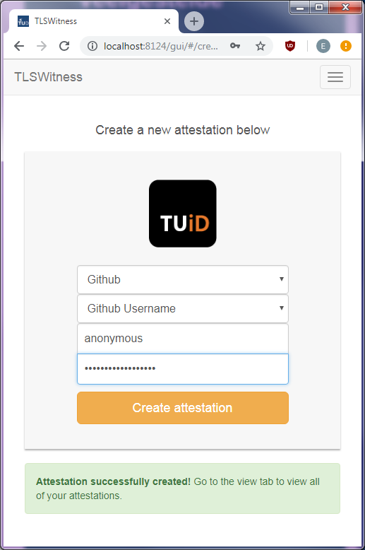
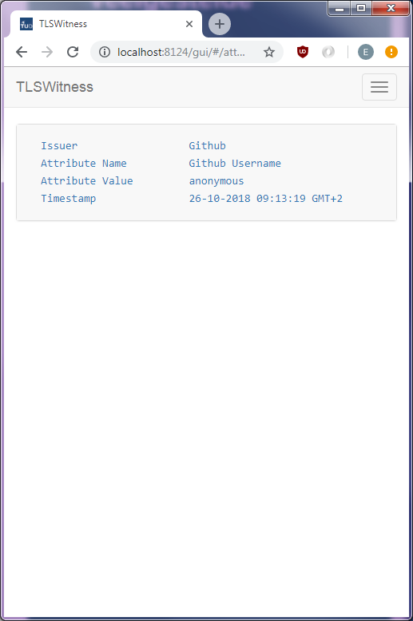
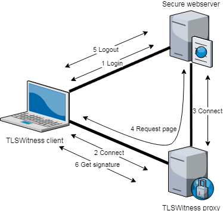

# OpenWallet

OpenWallet offers a privacy-friendly way to prove that you possess certain attributes. It works by letting a user connect to a secure server through a trusted third party proxy. When a client wants to prove that is posses a certain attribute, for instance, a GitHub username, it can login to github.com and make a request to display the username. Since the connection goes through the proxy, the proxy can witness that according to github.com the client is indeed linked to a particular GitHub username. Connections to github.com are encrypted using TLS, so after the connection is closed, the client will reveal the TLS keys to the proxy, which is then capable of seeing the traffic that took place.

Currently, every witnessed HTTP request is sent over a separate TLS tunnel. This ensures that the client will only have to reveal the TLS keys for the HTTP request that shows the desired attribute. Because of this mechanism, the proxy will not be able to decrypt other sensitive data, such as login credentials.

OpenWallet is still in the early stages of development, and is intended for demo purposes only. OpenWallet comes with a basic Angular webinterface shown below.

<p align="center">&ensp;</p>

## Getting started

We assume that you're using Windows with Python 2.7.x, OpenSSL 1.1.1, Git, and npm already installed, and you want to run the proxy server on 127.0.0.1:8123, and the client web interface on 127.0.0.1:8124. If your situation is different, please modify the commands accordingly.

First, let's checkout the code and run the proxy server. Open a command prompt and cd into the directory where you wish to store the project files. Next, execute the following commands:

```
git clone https://github.com/Tribler/OpenWallet.git
cd OpenWallet
pip install -r requirements.txt
```

Assuming you want to run the proxy server through a TLS tunnel, which is recommended, generate a self-signed certificate:

```
openssl req -x509 -nodes -days 365 -newkey rsa:2048 -keyout privkey.pem -out cert.crt -addext "subjectAltName = IP:127.0.0.1"
```

Now we can start the proxy server.

```
set PYTHONPATH=.
python2 openwallet\run_proxy.py --ip 127.0.0.1 --port 8123 --ssl privkey.pem,cert.crt
```

Finally, we compile the Angular web interface and run the client:

```
cd openwallet\webapp
npm i
ng build --base-href gui
cd ..\..
set PYTHONPATH=.
python openwallet\run_client.py --ip 127.0.0.1 --port 8124 --proxy_url https://127.0.0.1:8123 --proxy_cert cert.crt
```

While starting the client, you should give the filename of the certificate for the proxy server. This certificate will be pinned to ensure that we are indeed talking to the proxy server. You can omit the parameter, but then the certificate won't be checked!

## Basic protocol overview

The figure below shows the basic overview of the protocol. First, the client logs in to a secure webserver (1). Next, the clients sets up a connection to the proxy server (2), while the proxy server connects to the webserver itself (3). Now that the connection is proxied, the client issues a request for the webpage for which an attestation is required (4). Finally, the client logs out (5) and requests a signed attestation from the proxy (6). Note that only the request for the webpage to be attested is requested through the proxy.

<p align="center"></p>

## Proxying HTTPS connections

OpenWallet provides a basic proxy server with HTTPS tunneling capabilities. It is implemented in such a way that it is compatible with existing HTTP(S) proxies. When a client wants to connect to the proxy, it establishes a TCP connection and sends a CONNECT request:

```
CONNECT github.com:443 HTTP/1.1
Connection: close
OpenWallet: 1

```
This lets the proxy server know that the client wants it to monitor the connection to github.com:443. Upon successfully processing this request the proxy server will respond with:

```
HTTP/1.1 200 Connection Established
Connection: close
Connection-ID: 3/hsQlUyjAy3TCHFeBSJt4ph8c4=

```

The Connection-ID header can be used when the client wants to request a signature for the connection in question.

## Requesting signatures

After the client has requested a webserver to show certain attributes, it can then ask the proxy the decrypt the request and attest that the client posseses a particular attribute. The client must setup a separate TCP connection to the proxy and request a signature:

```
POST /request_signature HTTP/1.1
Connection: close
Content-Length: 228
Content-Type: application/json

{
    "connection_id": "3/hsQlUyjAy3TCHFeBSJt4ph8c4=",
    "gcm_keys": {"request": ("+zcJZ+ghnJgT9GYhHJRS6A==", "stlVeg=="),
                 "response": ("UXyw0C4DfjryTg8vJAjsXg==", "HMMFBg==")
    "regexes": [("request","Xig/OkdFVHxQT1NUfFBVVHxQQVRDSClccysoXFMrKVxzKyg/OkhUVFAp"),
                ("response","PG1ldGEgbmFtZT0iaG9zdG5hbWUiIGNvbnRlbnQ9ImdpdGh1Yi5jb20iPig/OlxzKik8bWV0YSBuYW1lPSJ1c2VyLWxvZ2luIiBjb250ZW50PSIoXFMrKSI+")]
}
```

This will give the poxy the ablity the decrypt the TLS traffic, after which it will use the provided base64-encoded regular expressions to extract the desired attribute. Next, the proxy will respond:

```
HTTP/1.1 200 Connection Established
Connection: close
Content-Length: 406
Content-Type: application/json
Signature: MEYCIQDh6hhjH51o5v4XZJ6SE0eRQ2J98g6fqSk20mbvfaWIGAIhAI9HclsKZyMR04YLV3DEed8HkDrUUVTV79yaWNn5imYr

{
    "time": 1540130776.893,
    "regexes": [("request","Xig/OkdFVHxQT1NUfFBVVHxQQVRDSClccysoXFMrKVxzKyg/OkhUVFAp"),
                ("response","PG1ldGEgbmFtZT0iaG9zdG5hbWUiIGNvbnRlbnQ9ImdpdGh1Yi5jb20iPig/OlxzKik8bWV0YSBuYW1lPSJ1c2VyLWxvZ2luIiBjb250ZW50PSIoXFMrKSI+")]
    "results": ["/settings/profile", "anonymous"],
    "server": "github.com:443"
    "connection_id": "3/hsQlUyjAy3TCHFeBSJt4ph8c4=",
    "public_key": "BA1DDaSAZXKo28KppQoPh7qjCwuitfZwJQ9BdHirbNnOxUh/+sI938x/IKRMcCMHa+92AgwVIOXYAEGUBUfrmS8=",
}
```

Signature is the base64-encoded attestation signature, while the attestation itself can be found in the response body.

## Security considerations

It is currently possible for the client to create fake attestations by doing a man-in-the-middle attack between the proxy and the webserver. This could be avoided by letting the proxy create the TLS session to the webserver (instead of the client itself). This, however, would enable to proxy to make requests without the client's approval.
